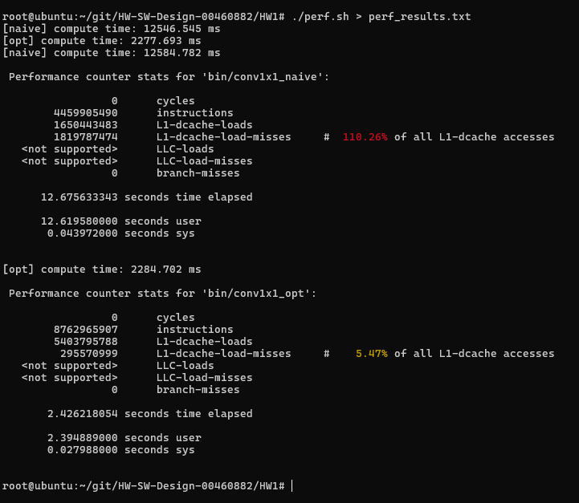

# HW1 — Speeding up a 1×1 Convolution by Changing the Data Layout

## Approach

We picked the 1×1 convolution (also called a pointwise convolution) as our program. It is
a small layer used a lot in convolutional networks, and the math behind it is very simple:
for every pixel you just take a weighted sum across the input channels.

```
out[co][h][w] = sum over ci of  in[ci][h][w] * weight[co][ci]
```

The reason we liked it for this assignment is that the amount of arithmetic is fixed, so we
could not cheat by computing less. Any speedup would have to come from how the data is
arranged in memory and how well the CPU can stream it. That made it a good fit for showing
the connection between the code and the hardware.

Our plan was straightforward. Write the obvious version first, profile it, look at where the
time goes, and then fix only that. Both versions use the same deterministic input generator
and print the same checksum and two sample values, so we can confirm the outputs are
identical with a normal `diff`. We also compiled both with the same flags (`-O3 -mavx2
-mfma`) so the difference we measure comes from our change and not from the compiler.

We used input and output tensors with `Cin = Cout = 512` and `H = W = 128`. Each tensor is
about 32 MB, which is bigger than the L3 cache on the test machine. We chose this on
purpose. When we first tried small tensors everything fit in cache and the two versions ran
almost the same (about 60 ms vs 58 ms), so the problem only gets interesting once the data
no longer fits in cache.

A note on the profiling machine: it was a virtualized Ubuntu host, and `perf` could not read
the `cycles`, `LLC`, or `branch-misses` counters there (they showed up as 0 or "not
supported"). The L1 data-cache counters did work, and since our whole argument is about L1
locality, those are the ones that matter. We use wall-clock time and instructions-per-second
instead of the cycle counter.

## The unoptimized version ([conv1x1_naive.cpp](../src/conv1x1_naive.cpp))

This is the version most people would write first. The data is stored in NCHW order, and the
loops just go `(co, h, w, ci)` with an accumulator in the middle.

> **Note on layout.** NCHW and NHWC just name the order the tensor dimensions are kept in
> memory, listed from the slowest-changing to the fastest-changing: N = batch, C = channels,
> H = height, W = width. In **NCHW** the width changes fastest, so one whole channel image is
> stored contiguously, but jumping to the next channel of the same pixel skips H×W elements.
> In **NHWC** the channels change fastest, so all the channels of a single pixel sit right
> next to each other. Our two versions differ only in this choice, and that is the whole
> story of the speedup.

The problem is the inner loop. It sums over the input channel `ci`, but in NCHW two channels
of the same pixel sit `H*W = 16384` floats apart, which is 64 KB:

```cpp
for (int ci = 0; ci < Cin; ++ci)
    acc += in[ci*HW + h*W + w] * wt[co*Cin + ci];   // in[] jumps 64 KB each step
```

Every step of that loop lands on a different cache line. The cache pulls in a 64-byte line
but we only use 4 bytes of it before moving 64 KB away, so almost all of it is wasted. The
hardware prefetcher cannot help either, because it expects steady, small strides, not 64 KB
jumps. On top of that the input ends up getting re-read once for every output channel.

Here is what `perf` reported for this version:

| Metric | Value |
|---|---|
| Runtime | 11.37 s |
| Instructions | 4.459 × 10⁹ |
| L1-dcache loads | 1.650 × 10⁹ |
| L1-dcache load misses | 1.587 × 10⁹ (96.17 % miss rate) |
| Instructions per second | about 0.38 billion |
| cycles / LLC / branch-misses | not supported (VM) |

The number that stood out was the 96 % L1 miss rate. Nearly every load misses the cache and
has to wait for memory, so the CPU is mostly sitting idle. That shows up as the very low
instruction rate of about 0.38 billion per second.

## The optimized version ([conv1x1_opt.cpp](../src/conv1x1_opt.cpp))

We made two changes that go together, without touching the math or the output.

First, we changed the layout from NCHW to NHWC. After transposing the input, the channel
values for one pixel are stored next to each other. Now the loop over `ci` walks straight
through memory one element at a time. The weight row for an output channel is already
contiguous, so both sides of the multiply are now sequential reads.

Second, we added a small amount of register blocking over the output channels, four at a
time. Each input value is loaded once and reused for four output channels held in registers:

```cpp
const float* xin = &in_nhwc[p*Cin];          // Cin contiguous floats
for (int co = 0; co < Cout; co += 4) {
    float a0=0, a1=0, a2=0, a3=0;
    for (int ci = 0; ci < Cin; ++ci) {
        float x = xin[ci];
        a0 += x*w0[ci]; a1 += x*w1[ci];
        a2 += x*w2[ci]; a3 += x*w3[ci];      // x reused 4 times
    }
    /* store a0..a3 */
}
```

We chose this because the naive profile clearly pointed at memory, not at arithmetic. So the
fix had to change how the data is read, not how much work is done. With a contiguous
reduction, one cache line now feeds 16 multiply-adds in a row, the prefetcher can run ahead,
and the compiler is able to use vector FMA instructions. The register blocking keeps the
arithmetic units busier by reusing each loaded value a few times.

`perf` for the optimized version:

| Metric | Value |
|---|---|
| Runtime | 2.28 s |
| Instructions | 8.763 × 10⁹ |
| L1-dcache loads | 5.404 × 10⁹ |
| L1-dcache load misses | 0.295 × 10⁹ (5.45 % miss rate) |
| Instructions per second | about 3.67 billion |
| cycles / LLC / branch-misses | not supported (VM) |

The direction was what we expected: the miss rate dropped from 96 % to about 5 % and the
runtime fell by roughly 5×. The part that surprised us a little was that the fast version
actually runs more instructions (8.76 B vs 4.46 B) and does more loads (5.40 B vs 1.65 B),
yet it still wins easily. The blocked loop re-reads the weights for each block of pixels, so
it does more bookkeeping, but those extra loads almost all hit L1 and are basically free.

## Comparing the two

| Metric | Naive | Optimized | Change |
|---|---|---|---|
| Runtime | 11.37 s | 2.28 s | about 5× faster |
| L1 miss rate | 96.17 % | 5.45 % | much lower |
| L1 load misses | 1.587 × 10⁹ | 0.295 × 10⁹ | ~5.4× fewer |
| L1 loads | 1.650 × 10⁹ | 5.404 × 10⁹ | ~3.3× more |
| Instructions | 4.459 × 10⁹ | 8.763 × 10⁹ | ~2× more |
| Instructions/sec | 0.38 B | 3.67 B | ~9.7× higher |

Both versions do the same 4.3 billion multiply-adds, so the difference is not about doing
less work. The naive version is slow because almost every load misses L1 and has to wait on
a far-away cache line that it then barely uses. The CPU spends most of its time waiting,
which is why it only retires about 0.38 billion instructions per second.

The optimized version reads the same data in long sequential runs, so about 95 % of the
loads hit L1 and the prefetcher hides most of the rest. The thing worth pointing out is the
apparent contradiction in the table: the fast version issues more loads and more
instructions but is still 5× faster. What matters is not how many loads you do but how long
each one takes. An L1 hit is a few cycles while a miss can be tens or hundreds, so trading a
smaller number of mostly-missing loads for a larger number of mostly-hitting loads is a big
net win. You can see the same thing in the instruction rate, which goes up about 9.7×
because the CPU is finally being kept busy instead of stalling on memory.

Here is the raw output from one of our `perf` runs, showing both versions back to back:



The exact figures shift a little from run to run (the L1 miss percentage even reads slightly
over 100 % on one run, which happens on this VM because the counters are sampled rather than
exact), but the picture is always the same: the naive version misses L1 almost every time
while the optimized version almost never does.

## Things we tried or considered

- Just turning on compiler optimization did not really help the naive version. The compiler
  cannot reorder the memory accesses for us, so the access pattern stays bad. That is also
  why we kept the flags identical for both versions.
- Small tensor sizes were not useful, because everything fit in cache and the two versions
  ran almost the same. We needed a size that spills out of cache for the effect to show.
- A full GEMM-style tiling (blocking both pixels and channels) would probably be even
  faster, but it makes the code harder to read and the single clear idea (layout plus reuse)
  gets lost, so we left it out.

## How to reproduce

```bash
bash run.sh        # compile, check the outputs match, then run perf
```

If the machine with `perf` does not have a compiler, build the binaries somewhere else with
`build_portable.sh` and copy the `bin/` folder over, then run `perf.sh`. All the progress
prints are behind a `VERBOSE` compile flag (`-DVERBOSE=0`) so the profiling runs stay clean.
